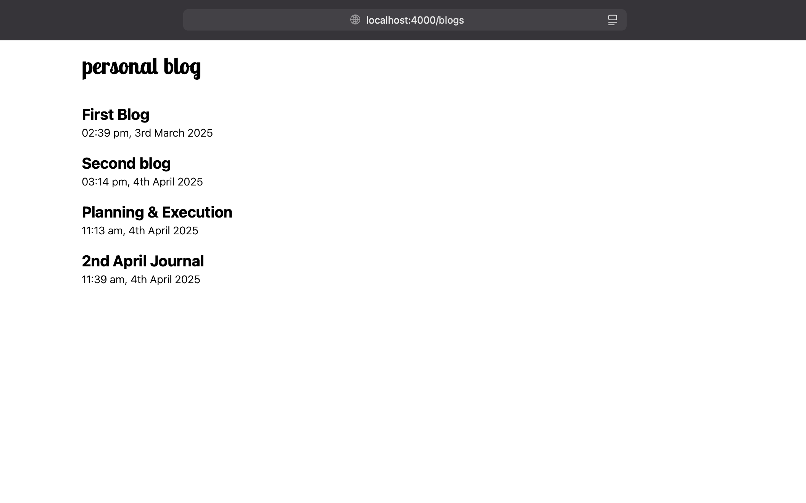
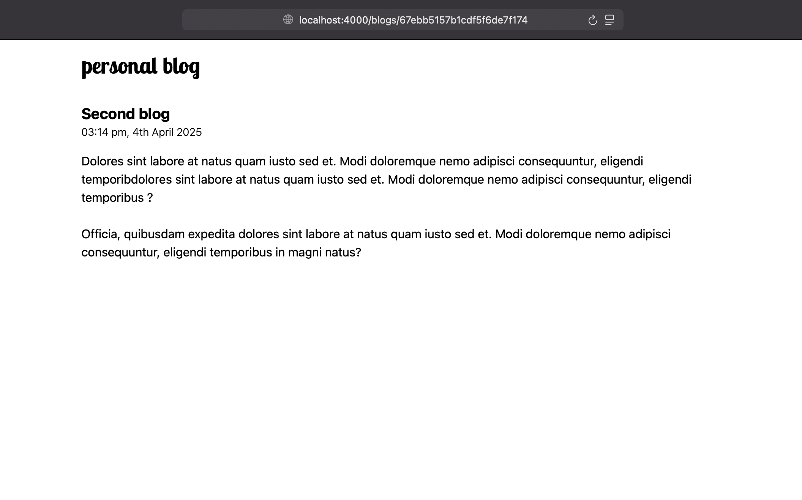
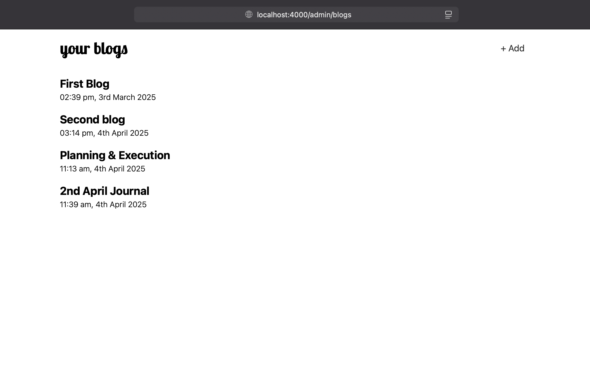
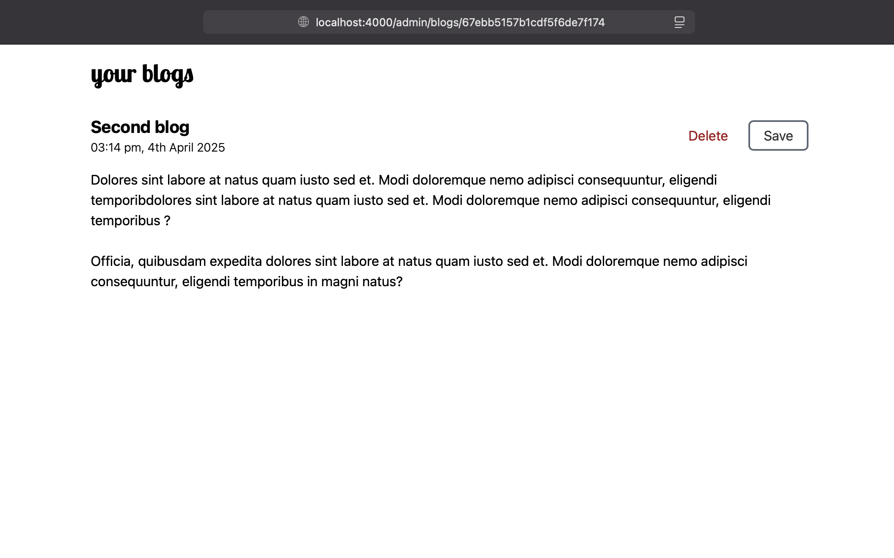

## Features

- App admin can manage & delete all the blogs.
- Guests can visit the public pages to browse through & read the blogs.

## Tech Stack

Node.js `v20.15.1` (Express), Clerk (for authentication), MongoDB, Handlebars view engine &
Tailwind CSS.

## Installation & Setup

Clone the repository:

```bash
git clone https://github.com/shubham-kv/personal-blog-expressjs.git
```

Move to the project directory and install the packages:

```bash
npm install
```

Create a [Clerk](https://clerk.com) application and get your clerk publishable
key & clerk secret key.

Rename the `.env.template` file to `.env` and fill in your environment
variables.

## Running the application

Create a production build with the `build` script & run in `production` mode with `start`:

```bash
npm run build
npm start
```

Use `dev` script to run the application in `development` mode:

```bash
npm run dev
```

Don't forget to run tailwind cli in watch mode:

```bash
npx @tailwindcss/cli -i ./public/layouts/main/input.css -o public/layouts/main/styles.css --watch
```

## Some Screenshots

**Public Pages:**




**Admin Pages:**




## Inspiration

[Roadmap.sh | Personal Blog](https://roadmap.sh/projects/personal-blog).
